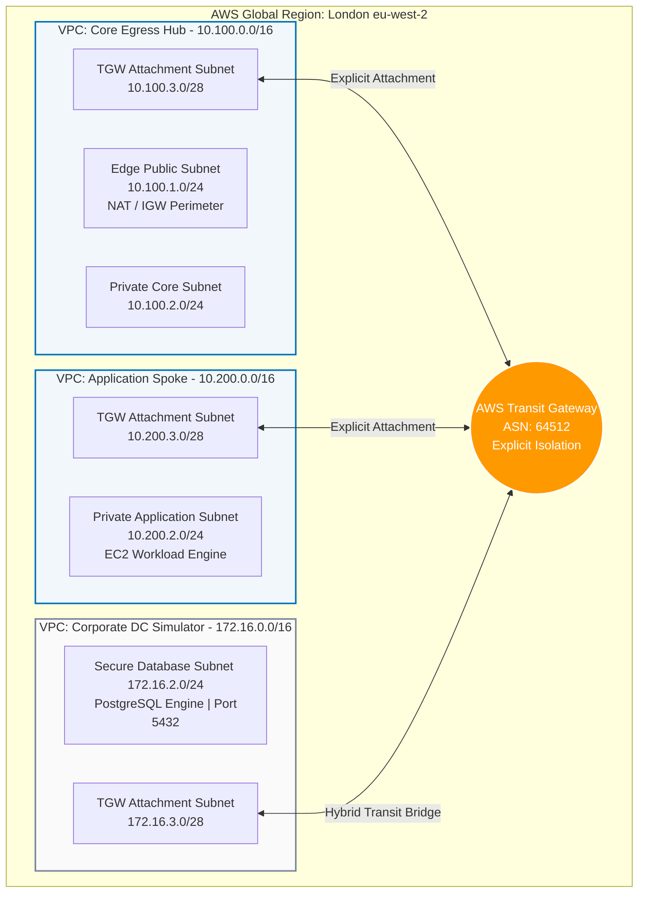

# AWS Hybrid Network Topology (Multi-Account Wave Blueprint)

```mermaid
graph TB
    subgraph AWS_Region [AWS Global Region: London eu-west-2]
        
        %% CENTRAL TRANSIT ENGINE
        TGW((AWS Transit Gateway <br> ASN: 64512 <br> Explicit Isolation))
        style TGW fill:#FF9900,stroke:#FFF,stroke-width:2px,color:#FFFFFF

        %% 1. CORE EGRESS HUB VPC
        subgraph HUB_VPC [VPC: Core Egress Hub - 10.100.0.0/16]
            direction TB
            hub_pub[Edge Public Subnet <br> 10.100.1.0/24 <br> NAT / IGW Perimeter]
            hub_priv[Private Core Subnet <br> 10.100.2.0/24]
            hub_tgw[TGW Attachment Subnet <br> 10.100.3.0/28]
        end
        style HUB_VPC fill:#F1F7FB,stroke:#0073BB,stroke-width:2px

        %% 2. APPLICATION SPOKE VPC
        subgraph APP_VPC [VPC: Application Spoke - 10.200.0.0/16]
            direction TB
            spoke_priv[Private Application Subnet <br> 10.200.2.0/24 <br> EC2 Workload Engine]
            spoke_tgw[TGW Attachment Subnet <br> 10.200.3.0/28]
        end
        style APP_VPC fill:#F1F7FB,stroke:#0073BB,stroke-width:2px

        %% 3. ON-PREMISES DATA CENTRE SIMULATOR
        subgraph ONPREM_VPC [VPC: Corporate DC Simulator - 172.16.0.0/16]
            direction TB
            onprem_db["Secure Database Subnet <br> 172.16.2.0/24 <br> PostgreSQL Engine | Port 5432"]
            onprem_tgw[TGW Attachment Subnet <br> 172.16.3.0/28]
        end
        style ONPREM_VPC fill:#FAFAFA,stroke:#7A869A,stroke-width:2px

    end

    %% INTERCONNECTIONS (TRANSIT ATTACHMENTS)
    hub_tgw <--> |Explicit Attachment| TGW
    spoke_tgw <--> |Explicit Attachment| TGW
    onprem_tgw <--> |Hybrid Transit Bridge| TGW
```